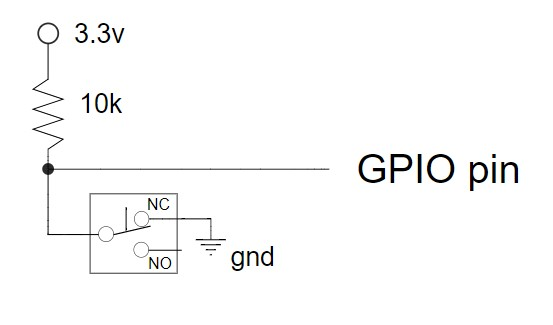

# gdoor
## Introduction 
Ths is a raspberry pi zero project that:
1) uses the gpio lib to reads/write digital io on some loop rate
2) write the door status, temperature, and humdity to a sqlite3 database/table (garage/door_state)
3) use php in apache to display the status on a network accessable webpage

I used this project to learn how to do raspberry pi projects. The program is written in c++, since that what I know best. And c++ applications run about 16 times faster than a python script. 

The raspberry pi zero w/ a 16G sd card can run standard programs and this project will push some assumptions on what I can build and run with moderate performance. 

## Features
* monitor and record the garage door open/close state 
  * present as a table on the web 
* includes a "help light" turned on for N minutes triggered with the door opens/closes
* monitor and record the temperature and humidity inside the garage
  * use a Si7021 sensor read using I2C
  * present readings as a 24hr chart on the web page
* runs as a singleton to prevent I/O set from multiple programs
  * if one instance of gdoor detects another instance, it exits
* uses a json configuration file for:
  * I/O name and pin assignments
  * timers and timebase values   

## Hardware
1. Raspberry PI Zero W w/ 5v 2amp power supply
2. Si7021 sensor
3. RPi Power Relay Board
4. mechanical switches and wire for door up/down position
5. light fixture and ac power cord 

## Software packages and libraries
1. Raspbian
2. Apache
3. Php
4. Sqlite3
5. Gnuplot 
6. PiWiring
7. Boost C++
8. Boost-ext sml 

All are the lastest versions. 

## Software structure
Gdoor uses a while loop as the main control structure following these steps:
1. read inputs
2. run sequencing code 
3. set outputs
4. repeat (a polling structure) 


## The configuration file
This configuration file is in json format, which is easy to write and edit. I like this configuration format much better that xml. The program uses Boost.PropertyTree to read and parse the file. The PropertyTree library is easy to use and a good tool for both hierarchical and record based data.

The config file is shown here: 
```
{
  "GarageDoorPi": {
    "name": "garage door monitor",
    "database_path": "/home/bjc/gdoor/exe/garage.db",
    "door_state_table": "door_state",
    "sensor_table": "readings",
    "digital_io": [
       { 
         "type": "input",
         "name": "up_position", 
         "pin": 23
       },
       { 
         "type": "input",
         "name": "down_position", 
         "pin": 24
       },
       { 
         "type": "output",
         "name": "door_cycling", 
         "pin": 27
       },
       { 
         "type": "output",
         "name": "help_light", 
         "pin": 25
       } 
    ],
    "loop_time_ms": 500,
    "pi_temp_read_interval_sec": 30, 
    "sensor_read_interval_sec": 300, 
    "help_light_on_time_sec": 600 
  }
}
```

ref: https://guides.github.com/features/mastering-markdown/

## GPIO phyical wiring

**I2C**, Si7021 temperaure and humidity sensor
 name | color | pin 
---|---|---
 3.3v | red   |  1 
 0v   | brn   |  6 
 SDA  | yel   | 3 
 SCL  | org   | 5 

**Door cycling LED**, An indicator to know that the software is running
 name | color | pin 
---|---|---
0v | blk | 39
gpio27 | yel | 36

**Up/down switches**, Two switch inputs for the door position
 name | color | pin 
---|---|---
3.3v | red | 17
0v | blk | 25
up | gpio23 | org | 33
down | gpio24 | yel| 35

## typical circuit for the switch inputs


**Help light**, (stacked connector (relay hat), so the 5/3.3V and 0v pins are not known)
 name | color | pin 
---|---|---
gpio25 | na | 

The light is then connected with L1 to relay C1 and NO1

## Garage door sequencing 

The program uses a a state machine to follow the door position and perform actions for some states. Orginally, I used switch/case and an enumeration for the state maching and that worked fine. The UML state diagram is shown here: 


I decided to try a state machine library improve my own knowledge and make the state logic more readable and chanageable for possible future enhancements.

Now, the program uses the boost::ext sml state machine library. ref: https://boost-ext.github.io/sml/index.html. This is a good project to learn the library since the door sequencing is simple. The transition table is shown here: 
```C++
// garage door sequencing 
state<Idle1> + event<eGdInit> / SetMovingLedOff = state<Startup>,
state<Startup> + event<eOnTime>[(IsUp && !IsDown)] / [] {} = state<Open>,
state<Startup> + event<eOnTime>[(!IsUp && IsDown)] / [] {} = state<Closed>,
state<Open> + sml::on_entry<_> / AddRowForOpen,
state<Closed> + sml::on_entry<_> / AddRowForClosed,
state<Open> + event<eOnTime>[!IsUp] / SetMovingLedOn = state<MovingToClose>,
state<Closed> + event<eOnTime>[!IsDown] / SetMovingLedOn =state<MovingToOpen>,
state<MovingToClose> + sml::on_entry<_> / AddRowForMovingToClose,
state<MovingToOpen> + sml::on_entry<_> / AddRowForMovingToOpen,
state<MovingToClose> + event<eOnTime>[IsDown] / SetMovingLedOff =state<Closed>,
state<MovingToClose> + event<eOnTime>[IsUp] / SetMovingLedOff = state<Open>,
state<MovingToOpen> + event<eOnTime>[IsUp] / SetMovingLedOff = state<Open>,
state<MovingToOpen> + event<eOnTime>[IsDown] / SetMovingLedOff =state<Closed>

```
 
## Database 

garage.db

### door_state schema 
```
sqlite> .schema door_state
CREATE TABLE door_state (
  id INTEGER PRIMARY KEY AUTOINCREMENT,
  rec_time text not null,
  state int not null,
  temperature text not null
);
```
### readings schema 
```
sqlite> .schema readings
CREATE TABLE readings (
  id INTEGER PRIMARY KEY AUTOINCREMENT,
  timestamp text not null,
  temperature text not null,
  temperature_units text not null,
  humidity text not null,
  humidity_units text not null
);
```
both gdoor and index.php use simple sqlite3_exec() and $db->query()  

## Webpage

http://www.rpz01.gleeze.com/

## Program startup

### from the command line 
```
usage: ./gdoor [-h] -c <config_file> [-s] 
  -h, optional, shows this help text, if included other arguments are
      ignored and the program shows this text
  -c, <config_file>, a json file with the configuration 
  -s, optional, the io and state information is not printed but error
       messages are 
Note: a space is required between -c and the config file 
example: ./gdoor -c config_1.json -s 
```
## as a service 

/usr/local/bin

## Some interesting classes
- sml: used for the state machine logic. The nice thing about sml is the writable and readable state machine transition table. Sml is not an easy library to use; it can be difficult to get data in and out of and compile errors are virtually unreadable because of the layering of templates.
- OneShot: the Changed() member outputs true once each time the value under test changes. This is useful in the while-loop controller when a digital input changes state and you need to set some action once only on change. The idea comes from the basic digital electronics circuit of the same name.  
- Reader: This is a base class active object. It's used in the while-loop controller when a feature/reading happens on a timed interval. The time-base has one second resolution. It's used for these three features: reading the Pi temperature, reading the Si7021 temperature and humidity, and setting the help light. The Reader class refactors conditions and flags that can happen with interval based features used in a time based while-loop.   
